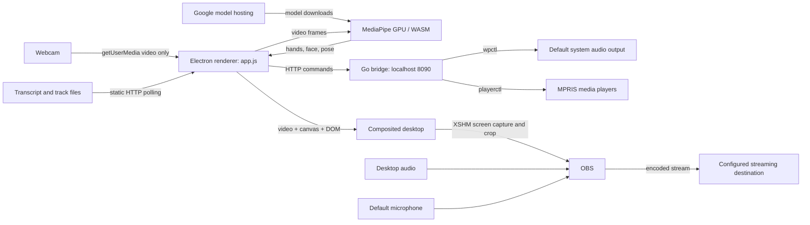
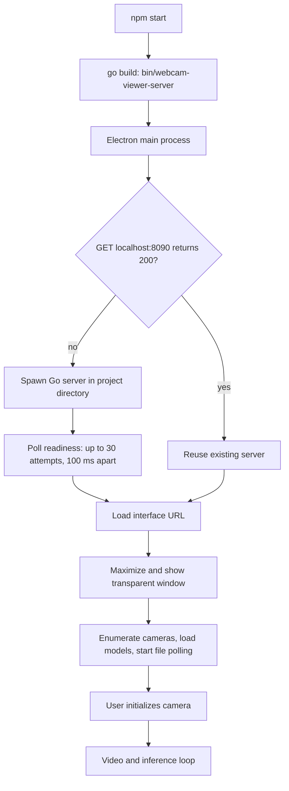
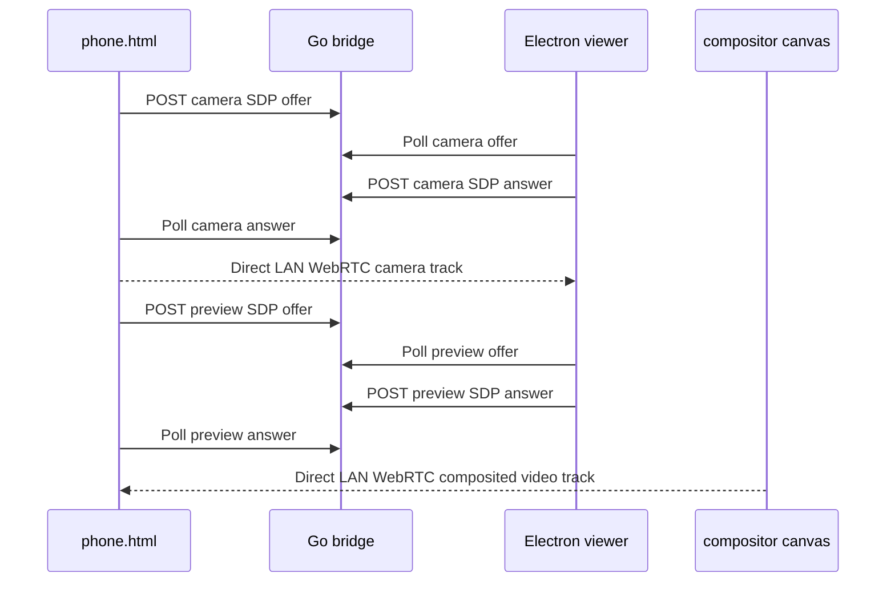
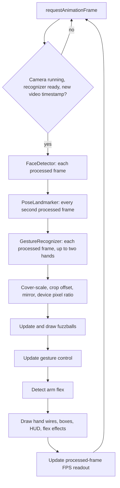
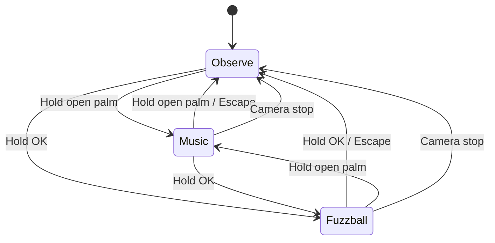
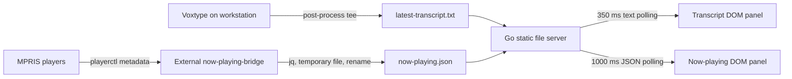

# Human Interface — design as it is

Snapshot: 2026-09-07. This describes the current working-tree implementation, including the recent fuzzball and gesture-control changes. It is a description of existing behavior, not a proposed architecture. Paths below are relative to this project unless absolute.

## Overall data flow



Camera inference and animation run locally in the renderer. Model assets are downloaded from Google; the application does not implement a cloud inference upload. OBS is a separate process that captures the desktop and audio. There is no direct video pipe from the renderer to OBS.

## Pieces and ownership

| Piece | Responsibility |
| --- | --- |
| `package.json`, `package-lock.json` | npm commands and dependency declarations/lockfile; Electron and MediaPipe Tasks Vision. |
| `electron-main.js` | Starts or reuses the local HTTP bridge and opens the transparent desktop window. Owns a bridge process only when it launched that process. |
| `server.go`, `go.mod` | Static file serving and two narrowly scoped system-control endpoints. Compiles to ignored `bin/webcam-viewer-server`. |
| `index.html` | Video, effect canvas, HUD, transcript, now-playing panel, gesture cursor, and camera/mode buttons. |
| `styles.css` | Transparent composition, dimmed camera image, hand-control styling, particle glow, responsive controls and HUD. |
| `app.js` | Camera lifecycle, model loading, frame loop, effects, control dispatch, DOM updates, and file polling. Most runtime state lives in module variables here. |
| `gesture-controls.mjs` | Pure hand-shape classification and hold/latch timing used for OK and open-palm mode switches. |
| `gesture-controls.test.mjs` | Node tests for geometric recognition, rotation/mirroring, short tracking gaps, release/rearm, and long tracking loss. |
| `scripts/setup-obs.sh` | Copies the versioned scene/profile into the user's OBS configuration, backing up differing target files. |
| `scripts/launch-streaming.sh` | Runs OBS setup, starts the overlay if needed, then launches OBS with the named profile and collection. |
| `obs/scene-collection.json` | One desktop scene, its screen crop, and default desktop/microphone audio sources. |
| `obs/profile.ini` | Encoding, canvas/output, audio, reconnect, and recording defaults. |
| `latest-transcript.txt`, `now-playing.json` | Ignored runtime inputs written by workstation integrations outside this repository. |

## Startup and process lifetime



The bridge probe has a 300 ms request timeout and checks HTTP status only, not server identity. The window starts at 1440 × 900 before maximizing. Renderer settings enable context isolation and sandboxing and disable Node integration. The permission callback permits media requests from the local interface URL and denies other requested permission types.

## Phone camera prototype



`phone.html` is a browser prototype rather than a native Android app. It captures video only, creates a direct peer connection with an empty ICE-server list, and waits for complete ICE gathering before exchanging SDP through the bridge. The viewer's **Video source** selector chooses Local webcam or Phone camera. In Phone camera mode, the renderer accepts the phone track into the same video/inference loop; a second peer connection sends a 15 FPS stream from the hidden compositor canvas back to the phone's Processed preview element. Both signaling directions are held in process memory and support one active phone session; a new offer replaces the previous one.

The bridge remains bound to `127.0.0.1:8090` by default. `scripts/phone-start.sh` sets `WEBCAM_VIEWER_BIND=0.0.0.0`, creates a one-year self-signed certificate with the detected LAN IP as a subject alternative name, and starts an HTTPS copy on port 8443. Open `https://<workstation-LAN-IP>:8443/phone.html` and accept the browser's local-certificate warning. Direct `WEBCAM_VIEWER_BIND=0.0.0.0 npm run serve` remains HTTP-only and cannot request phone camera permission in Chrome. The HTTPS listener has no authentication; WebRTC candidates are host candidates only, so this prototype is intended for the same local network and does not handle NAT traversal. Reloading or stopping the viewer closes both phone peer connections. The phone page currently shows its local camera until the returned processed track arrives; it does not publish to a streaming service.

Closing all windows quits Electron. Before quitting, Electron kills the bridge it spawned; a reused bridge remains independent. Reloading resets renderer state and turns the camera off until initialized again. Starting or changing a camera first stops the previous stream and clears tracking/control state.

`npm run serve` builds and runs just the Go server for a regular browser. Browser rendering does not provide the same desktop transparency as the Electron window.

## Camera, inference, and drawing



The video element uses `object-fit: cover`; landmark coordinates use the same scale and centered crop offsets. Mirroring changes displayed X coordinates as well as the video transform. The canvas backing resolution follows stage size multiplied by device pixel ratio.

The camera request uses `audio: false`. When a device is selected, the request specifies that exact device; the ideal 1920 × 1080 / 30 FPS constraints are only used when no device ID is supplied. The actual camera resolution can therefore differ from OBS's output resolution.

Models are loaded sequentially: gesture recognition, short-range face detection, then lightweight pose landmarks. All request the GPU delegate and use the WASM assets from `node_modules`. Face-loading failure logs an error and leaves pose-based nose targeting available; pose-loading failure permits hand recognition to continue. A failure of the initial gesture model prevents the frame-processing path from running. No worker thread or automatic CPU fallback is implemented.

### Fuzzball simulation

There are 34 randomized balls, recreated when canvas dimensions change. Each stores position, velocity, radius, color, phase, and an optional retreat deadline.

| Behavior | Motion |
| --- | --- |
| Attack nose | Accelerates toward face keypoint 2; falls back to pose landmark 0 when its visibility is at least 0.6. Bounces outward near the nose, retreats for 350–700 ms, then resumes attack. The target itself is never drawn. |
| Drift | Applies gentle oscillating forces without attraction. Switching into Drift reduces existing velocity to 15%. |
| Freeze | Skips motion updates, including hand collision forces. Hair shimmer still animates; resizing can recreate the balls. |

Attack and Drift both respond to hand wire segments: proximity repels the balls, and frame-to-frame hand motion adds velocity. Speed is capped, drag slows motion, and canvas boundaries bounce balls back. With no valid nose target, Attack continues ordinary drifting/collision behavior. The physics is per processed frame rather than elapsed-time normalized, so speed depends on inference FPS.

Arm-flex effects are separate from fuzzballs. Shoulder/elbow/wrist geometry latches each arm when bent below 72 degrees with the wrist sufficiently raised, and rearms after extending beyond 112 degrees. A trigger emits a ring and 14 particles lasting 950 ms.

## Hand-control state and behavior state

These are separate: leaving hand control does not turn off or change the selected fuzzball behavior.



OK is a geometric test for thumb/index contact plus three extended fingers, not a built-in named MediaPipe gesture. Palm recognition combines geometric extension with the canned `Open_Palm` classification. Either detected hand can request a mode switch; OK takes priority if both signs are present. A sign is held for one second, tolerating tracking gaps up to 250 ms. It latches after firing and rearms after release or a different sign. The HUD displays `OK SIGN` / `OPEN HAND`, hold progress, and `ACCEPTED`.

| Input | Music control | Fuzzball control |
| --- | --- | --- |
| Thumb up / down | Default output volume ±5% | No volume action |
| Peace / Victory | Next media track | Next behavior |
| Closed fist | Previous media track | Previous behavior |
| Index fingertip + pinch | App-local cursor and click | No app cursor |
| Escape | Observe | Observe |

Next behavior wraps through **Attack nose → Drift → Freeze → Attack nose**; previous reverses that order. The Fuzzballs button always cycles forward, regardless of hand-control mode. Reload defaults to Observe with Attack nose selected.

Mode switching examines both hands, but media/volume gestures and pointer coordinates currently use the first result. Media and volume actions are latched until their recognized action is absent; the current code does not provide the same dropout tolerance as the mode-switch hold helper. Clicks use `document.elementFromPoint` and the nearest button/select, not the system pointer. OK recognition suppresses the music-mode pinch click.

## Local control bridge

```mermaid
sequenceDiagram
    participant Hand as Gesture dispatch
    participant HTTP as Go HTTP bridge
    participant CLI as wpctl / playerctl
    participant OS as Audio or media session
    Hand->>HTTP: POST JSON action
    HTTP->>HTTP: Validate method, Origin, content type, body size, action
    HTTP->>CLI: Execute fixed command and allowed argument
    CLI->>OS: Apply action
    OS-->>CLI: Result
    CLI-->>HTTP: Exit status / volume output
    HTTP-->>Hand: JSON success or error
    Hand->>Hand: Update HUD; log errors
```

| Endpoint | Request body | Effect |
| --- | --- | --- |
| `POST /api/volume` | `{"direction":"up"}` or `{"direction":"down"}` | `wpctl set-volume -l 1.0 @DEFAULT_AUDIO_SINK@ 5%+` or `5%-`, then `wpctl get-volume`. |
| `POST /api/media` | `{"action":"next"}` or `{"action":"previous"}` | `playerctl next` or `playerctl previous`. |
| `GET /…` | None | Static files rooted at the server's working directory. |

The server binds to `127.0.0.1:8090`. POST requests require JSON, have a 256-byte body limit, and reject a supplied Origin that differs from `http://127.0.0.1:8090`. Missing Origin is allowed. Commands use explicit argument arrays and action allowlists; there is no general shell-execution endpoint. Responses use JSON and `Cache-Control: no-store`. There is no authentication token, command timeout, or dedicated health endpoint. The static server exposes the project directory to local HTTP clients; it is not a curated asset-only root.

## Transcript and now-playing inputs



Observed workstation integration points, outside this repository:

- `/home/quartermeat/.config/voxtype/config.toml` configures `tee /home/quartermeat/work/webcam_viewer/latest-transcript.txt` as the transcription post-process command.
- `/home/quartermeat/.local/bin/now-playing-bridge` polls MPRIS every second, preferring a Playing player and otherwise a Paused player. It writes JSON via a temporary file and rename.
- `/home/quartermeat/.config/systemd/user/now-playing-bridge.service` runs that helper as part of the graphical session and restarts it on failure.

The renderer expects track fields `active`, `player`, `status`, `artist`, `title`, `album`, and `artUrl`. It assigns the artwork URL to an image element. Transcript text is displayed using `textContent`; there is no speech-to-command parser. Scroll Lock's speech action is an external workstation binding, not an event handler in this app.

Polling uses cache-busting timestamps and `cache: no-store`. Read failures produce standby/offline indicators. Successful reads alone do not establish freshness: a stopped producer can leave stale text or track metadata visible. The transcript is the latest nonempty value, not a history. The now-playing display can select a player different from the bridge's unqualified `playerctl next/previous` target.

## OBS and broadcasting

`npm run stream` installs templates, conditionally launches the overlay, and opens OBS. It does **not** press Start Streaming. The setup script refuses to install into the default OBS configuration while OBS is running. Differing scene/profile targets receive timestamped `.backup-…` copies before replacement. Existing `service.json` is preserved; a missing one is initialized to an empty object.

The versioned scene collection contains one `Desktop + Interface` scene with a visible `Full Desktop (XSHM)` source. Despite the source name, it has explicit source-level crop settings: `cut_top=57`, `cut_bot=132`, `cut_right=1713`, screen 0, cursor enabled. The scene item fits the resulting capture into 1920 × 1080 bounds. These desktop-specific values are important when relocating/resizing the viewer or changing monitors. The README's broader full-desktop description does not capture this detail.

Template output defaults: 1920 × 1080, 30 FPS, NVENC H.264, 6000 Kbps video, AAC 160 Kbps, stereo 48 kHz, and reconnect attempts every two seconds up to 25 times. Recording defaults to MKV under `/home/quartermeat/Videos`. These are template values; live OBS settings can differ after interactive edits.

OBS captures desktop audio and the default microphone independently of the renderer's video-only camera stream. Anything visible inside the screen capture region can enter the broadcast, including other application windows. The repository contains no direct OBS WebSocket client or programmatic streaming-status feedback.

Facebook was configured interactively during this session; destination credentials belong to user OBS configuration and are intentionally omitted here. TikTok access was investigated but no TikTok adapter was implemented. Simultaneous multi-service broadcasting remains a requested future capability: the current repository has neither a multiple-output plugin setup nor a relay service.

## Canonical commands and verification

Run from `/home/quartermeat/work/webcam_viewer` with Node/npm, Go, and the relevant desktop CLI tools on PATH.

| Command | Purpose |
| --- | --- |
| `npm start` | Build bridge and launch Electron. |
| `npm run serve` | Build bridge and serve browser interface. |
| `npm run obs:setup` | Install OBS templates, with backups where targets differ. |
| `npm run obs` | Open the installed OBS profile/collection. |
| `npm run stream` | Install templates, ensure overlay process, open OBS. |
| `npm test` | Run pure gesture-control regression tests. |
| `curl -I http://127.0.0.1:8090/` | Check static HTTP availability; not camera or stream health. |
| `node --input-type=module --check < app.js` | Check renderer JavaScript syntax. |

Renderer errors appear in Electron developer tools with an `[Interface]` prefix. The bridge logs startup and command failures to its inherited output. When the streaming launcher starts the overlay, it redirects output to `${TMPDIR:-/tmp}/webcam-viewer-overlay.log`. OBS keeps its own logs under the user's OBS configuration directory; those logs are the source for connection and encoder diagnostics.

Automated coverage currently verifies gesture geometry and hold timing. It does not verify actual camera tracking, GPU/model availability, all application control transitions, audio-device selection, OBS capture framing, or delivery to a streaming platform. Those require runtime checks. The application does not persist chosen hand-control or fuzzball modes across reloads, and model reloads/network availability and main-thread inference affect startup and responsiveness.
